<h3>
<code>goodchanges@github ~ $ ./contributions.sh</code>
</h3>

  

<h3>
<code>goodchanges@github ~ $ whoami</code>
</h3>

<table>
<tr>

<td valign="top">

</td>

<td valign="top">

</td>

</tr>
</table>

 

<h3>
<code>goodchanges@github ~ $ ls ./open-source</code>
</h3>

 

<h3>
<code>goodchanges@github ~ $ ./contact.sh</code>
</h3>

<a href="https://github.com/goodchanges">
GitHub
</a>
&nbsp;•&nbsp;
<a href="https://github.com/goodchanges/portfolio">
Portfolio
</a>

